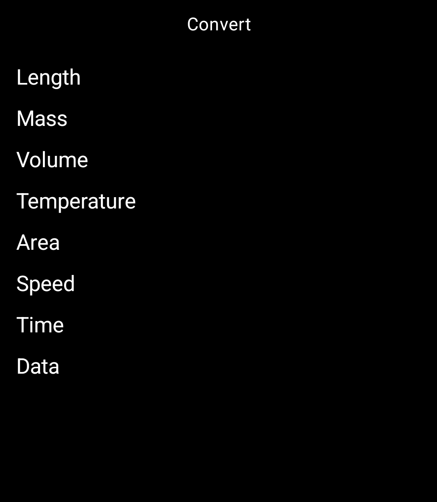
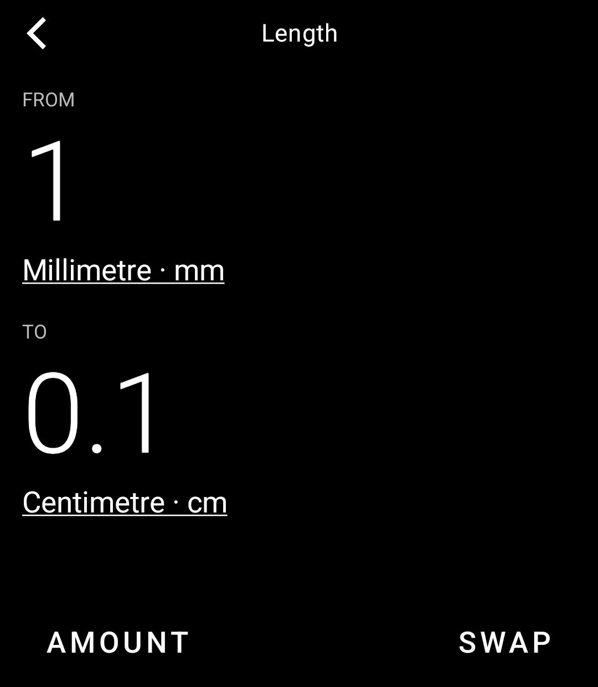
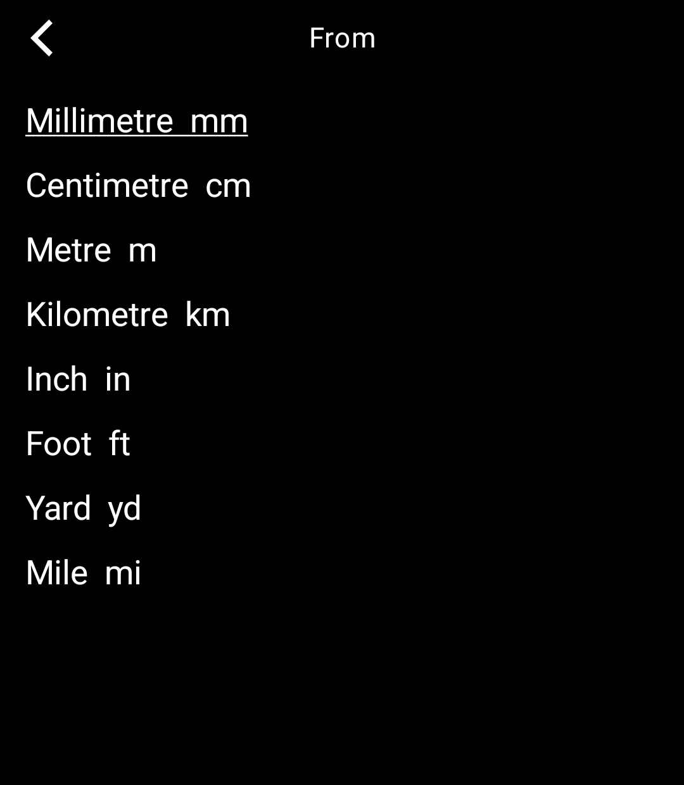
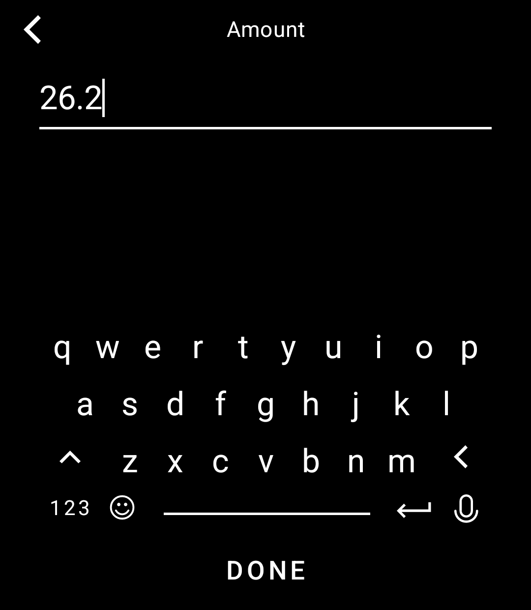
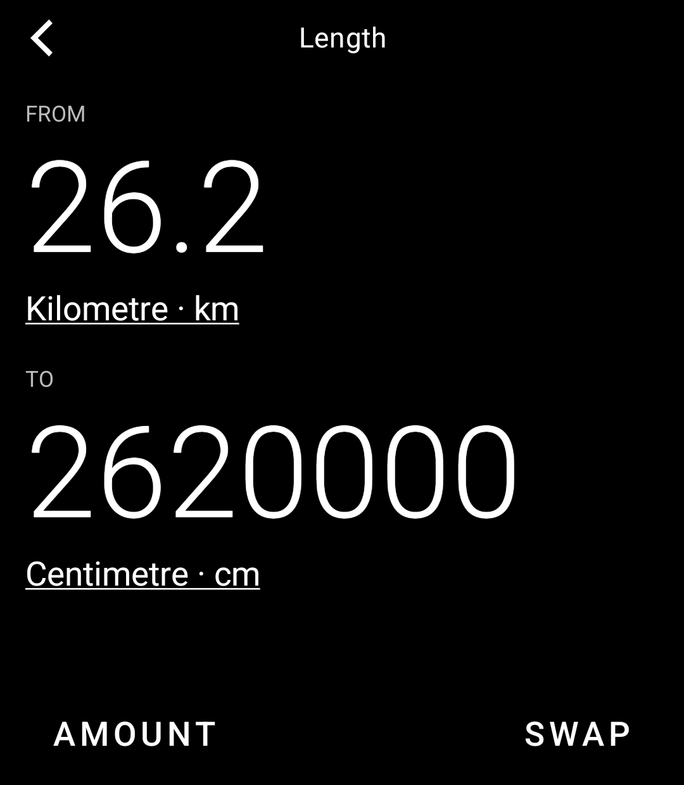

# Convert

A unit and currency converter for the Light Phone III, built on the
[Light SDK](https://github.com/lightphone/light-sdk).

Units convert offline: length, mass, volume, temperature, area, speed, time,
data. Currency uses the European Central Bank's published daily reference
rates, fetched once a day when a connection is available and kept on the
phone, so the last rates keep working offline. No account, no API key, no
analytics, nothing sent anywhere but the ECB feed.

## Status

Units work end to end in the LightOS emulator: pick a category, pick units,
type an amount, swap. Currency is not built yet.

| Home | Converter | Pick a unit | Amount | Result |
|---|---|---|---|---|
|  |  |  |  |  |

## Build

    ./gradlew :tool:assembleDebug
    adb install -r tool/build/outputs/apk/debug/tool-debug.apk
    adb shell am start -n com.github.unfixedjuices.convert/com.thelightphone.sdk.LightActivity

Follow the SDK's [emulator instructions](../docs/system_app) to run against
the LightOS emulator app.

## Layout

This repository is a fork of `light-sdk`. Everything outside `tool/` is the
SDK, kept in sync with upstream and not edited here, so Light's build server
can compile `tool/` against the official SDK release. The tool's metadata is
`tool/lighttool.toml`; its source is `tool/src/main/kotlin`.

## License

MIT, same as the SDK.
